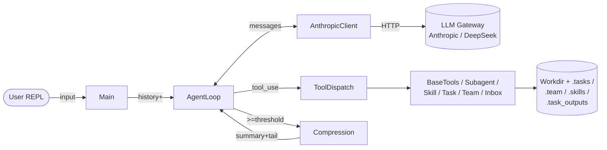
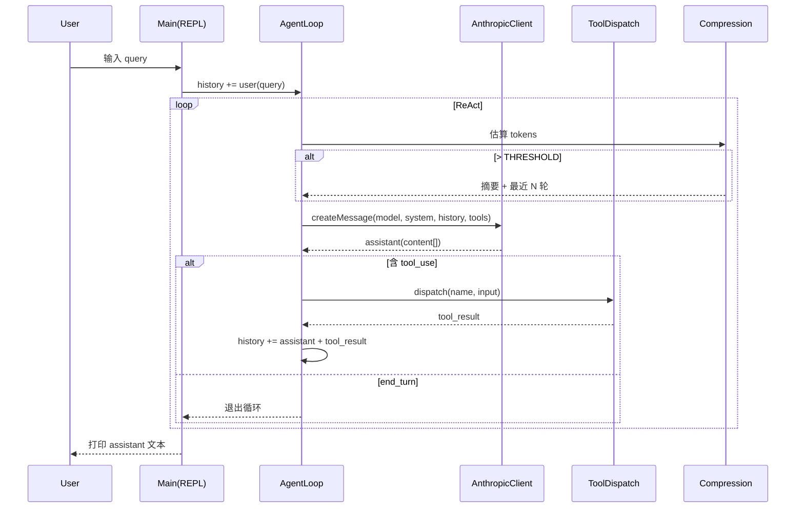

# 技术文档 — claude-code-java

> 本文为 [claude-code-java](./README.md) 的技术参考，面向二次开发者与 code review。
> 内容覆盖：架构总览、核心模块、协议与上下文管理、扩展点、关键决策。

## 目录

- [1. 架构总览](#1-架构总览)
- [2. 运行时数据流](#2-运行时数据流)
- [3. 核心模块详解](#3-核心模块详解)
- [4. Anthropic 协议与多端兼容](#4-anthropic-协议与多端兼容)
- [5. 上下文管理：压缩与持久化](#5-上下文管理压缩与持久化)
- [6. 多智能体与消息总线](#6-多智能体与消息总线)
- [7. Skill 加载机制](#7-skill-加载机制)
- [8. 工具清单（25 个）](#8-工具清单25-个)
- [9. 配置与环境变量](#9-配置与环境变量)
- [10. 扩展指南](#10-扩展指南)

---

## 1. 架构总览



整个系统是一个**单进程**的 ReAct 风格循环：
LLM 输出 `tool_use` → 本地执行 → 结果作为 `tool_result` 回写 → 继续推理，直到 LLM 给出 `end_turn`。

---

## 2. 运行时数据流



---

## 3. 核心模块详解

### 3.1 `core/AgentLoop`
- 维护单轮会话的 ReAct 循环；
- 在每次请求前调用 `Compression.autoCompact` 检查是否需要压缩；
- 捕获 LLM 调用失败时注入 `<error>` 块作为软回退（对应 Python s11 robustness）。

### 3.2 `core/ToolDispatch`
- 集中注册全部 25 个工具的 `ToolDefinition`（schema）与 `handler`（lambda）；
- 处理 `shutdown_request`、`plan_approval` 等治理类工具；
- 对每个工具结果统一做"大输出 → 持久化"判定（见 §5）。

### 3.3 `core/SystemPrompt`
- 动态拼装 system prompt：包含工作目录、可用 Skills 列表、当前任务/团队状态等；
- 每轮调用都会重建，确保 LLM 看到的状态是最新的（这与 Python 一致）。

### 3.4 `core/Context`
- `Context.CLIENT`、`Context.TASK_MGR`、`Context.TEAM`、`Context.BUS`、`Context.SKILLS`、`Context.BG` 等单例；
- 既是 manager 之间共享数据的入口，也是工具 handler 依赖注入的来源。

---

## 4. Anthropic 协议与多端兼容

`AnthropicClient` 直接对接 Anthropic Messages API（`POST /v1/messages`），请求/响应格式严格遵守官方协议：

```json
{
  "model": "...",
  "max_tokens": 4096,
  "system": "...",
  "messages": [{"role":"user","content":[...]}],
  "tools": [{"name":"...","description":"...","input_schema":{...}}]
}
```

**端点切换策略**：

| 场景 | `ANTHROPIC_BASE_URL` | 鉴权头 |
|---|---|---|
| Anthropic 官方 | 不设置 | `Authorization: Bearer $ANTHROPIC_AUTH_TOKEN` |
| DeepSeek 兼容端点 | `https://api.deepseek.com/anthropic` | `x-api-key: $ANTHROPIC_API_KEY` |
| 自建网关 | 自定义 | 任一鉴权头均可 |

[Main.java](../src/main/java/viper/com/claudecode/Main.java) 启动时会做策略判定：**只要设置了 `ANTHROPIC_BASE_URL`，就清空 `ANTHROPIC_AUTH_TOKEN`**，避免双 header 冲突。

> 协议要求的版本头 `anthropic-version: 2023-06-01` 由客户端固定写入。

---

## 5. 上下文管理：压缩与持久化

两种机制串联工作，让 Agent 不会被无限增长的对话拖垮：

### 5.1 自动压缩（`compress/Compression`）

- 触发条件：估算 token 数 ≥ `Config.TOKEN_THRESHOLD`（默认 100,000）；
- 流程：调用一次 LLM 把"前面 N-K 轮"摘要为单条 `user` 消息，再保留最近 `KEEP_RECENT=3` 轮原文；
- `read_file` 工具结果会被保留（属于 `PRESERVE_RESULT_TOOLS`），避免摘要把代码内容糊掉。

### 5.2 大输出持久化（`tools/PersistedOutput`）

- 阈值：默认 `50,000` 字符，`bash` 类工具调低到 `30,000`；
- 超阈值的 tool_result 会被写入 `.task_outputs/tool-results/<id>.txt`，并在对话里替换为：

  ```
  <persisted-output>
  [stored at .task_outputs/tool-results/xxx.txt, 120000 chars]
  preview (first 2000 chars):
  ...
  </persisted-output>
  ```

LLM 后续可通过 `read_file` 重新读取完整内容。

---

## 6. 多智能体与消息总线

### 6.1 角色拓扑

```
       ┌──────────────┐
       │     lead     │ ← REPL 用户对接的智能体
       └──────┬───────┘
              │ recruit_teammate
   ┌──────────┼──────────┐
   ▼          ▼          ▼
teammate-1  teammate-2  teammate-N
```

### 6.2 `MessageBus`（`.team/inbox/<role>.jsonl`）

- 每个 role 一份 JSONL 收件箱；
- 支持类型：`message`、`broadcast`、`shutdown_request`、`shutdown_response`、`plan_approval_response`；
- 消费语义：读取后会标记 `read=true`，避免重复消费。

### 6.3 `TeammateManager`

- 维护两阶段循环：**work 阶段**执行用户分派任务；**idle 阶段**轮询收件箱（间隔 `POLL_INTERVAL=5s`，超时 `IDLE_TIMEOUT=60s`）；
- 收到 `shutdown_request` 会上报 `shutdown_response`，由 lead 汇总后真正终止；
- 整个机制对应 Python `s09_messaging` + `s11_robustness`。

---

## 7. Skill 加载机制

`SkillLoader` 启动时扫描 `skills/` 目录，每个 `.md` 文件都被视为一个 Skill：

```
skills/
└── git-commit-helper.md   # frontmatter: name / description / triggers
```

LLM 通过工具 `use_skill(name)` 把对应 Markdown 全文以 `system` 注入下一轮，实现"按需加载领域知识"。

---

## 8. 工具清单（25 个）

| 分类 | 工具 |
|---|---|
| 文件 | `read_file`, `write_file`, `edit_file`, `list_dir`, `search_files`, `glob`, `grep` |
| Shell | `bash` (跨平台，Win 用 `powershell`) |
| 任务/Todo | `create_todo`, `update_todo`, `list_todos`, `create_task`, `update_task`, `list_tasks` |
| 团队 | `recruit_teammate`, `send_message`, `broadcast_message`, `read_inbox`, `shutdown_request` |
| 治理 | `plan_approval`, `request_plan_approval` |
| 元能力 | `use_skill`, `run_subagent`, `run_in_background`, `read_background` |

> 完整 schema 见 [`ToolDispatch.java`](../src/main/java/viper/com/claudecode/core/ToolDispatch.java)。

---

## 9. 配置与环境变量

| 变量 | 必填 | 默认 | 说明 |
|---|---|---|---|
| `MODEL_ID` | ✅ | — | 例如 `deepseek-chat` / `claude-3-7-sonnet-latest` |
| `ANTHROPIC_BASE_URL` | ⛔ | `https://api.anthropic.com` | 自定义网关地址 |
| `ANTHROPIC_API_KEY` | 二选一 | — | 走 `x-api-key`（DeepSeek 等） |
| `ANTHROPIC_AUTH_TOKEN` | 二选一 | — | 走 `Bearer`（仅在未设 BASE_URL 时使用） |

落盘目录（运行时自动创建）：`.tasks/`、`.team/inbox/`、`.task_outputs/`、`.transcripts/`、`skills/`。

---

## 10. 扩展指南

### 10.1 新增一个工具

1. 在 [`ToolDispatch.java`](../src/main/java/viper/com/claudecode/core/ToolDispatch.java) 的 `TOOLS` 列表里追加 `ToolDefinition`（含 `input_schema`）；
2. 在 `TOOL_HANDLERS` 注册同名 lambda：`(input, ctx) -> String`；
3. 大输出会由公共逻辑自动持久化，无需关心阈值。

### 10.2 接入新模型供应商

1. 确认对端是否兼容 Anthropic Messages 协议；
2. 设置 `ANTHROPIC_BASE_URL` + 对应鉴权变量；
3. 若对端有特殊 header，可在 [`AnthropicClient.createMessage`](../src/main/java/viper/com/claudecode/AnthropicClient.java) 中扩展。

### 10.3 替换上下文摘要策略

- `Compression.autoCompact` 当前用同一个 LLM 做摘要，可替换为更小的本地模型；
- 调整 `Config.TOKEN_THRESHOLD` / `KEEP_RECENT` 即可改变压缩节奏。

---

> 如发现行为与 [`s_full.py`](../s_full.py) 不一致，欢迎对照各 manager 的 Java 实现提 PR / Issue。
